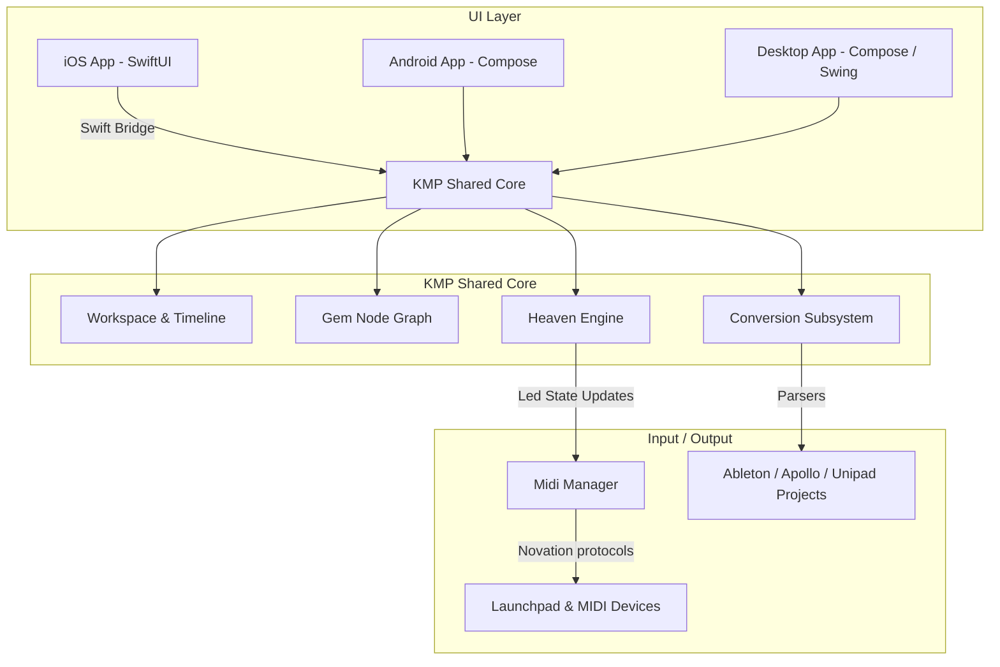

# 🔮 Amethyst

[](https://kotlinlang.org)
[](https://github.com/JetBrains/compose-multiplatform)
[](https://kotlinlang.org/docs/multiplatform.html)
[](https://sentry.io/)

Amethyst is a powerful, modern, cross-platform application designed for creating, editing, and playing stunning Launchpad lightshows and musical performances. Engineered using **Kotlin Multiplatform (KMP)** and **Compose Multiplatform**, Amethyst is built from the ground up to deliver a unified, high-performance experience on Desktop (macOS, Windows, Linux) and Mobile (Android, iOS) platforms, while embracing native UI paradigms where they matter most.

> [!NOTE]  
> This application is currently under active development and is in a very early alpha state. Expect regular updates, architectural optimizations, and feature enhancements.

---

## 🎨 Visual Identity


---

## ✨ Features

- 🖥️ **Virtual Launchpad Workspace**: Interactive, beautifully rendered visual representations of your launchpad desk layout.
- 🚀 **Heaven Render Engine**: High-frequency, multi-threaded rendering engine that schedules and drives pixel-perfect LED states, custom layers, and professional blending modes (Normal, Mask, Multiply, Screen).
- 🧬 **Gem Node Graph Editor**: A visual visual-programming interface (analogous to custom patchers) offering real-time control over math, logic, timing, values, structures, and LED packaging.
- 🎛️ **Comprehensive Effect Chain**: Over 27 configurable chain devices and filters (Blur, Choke, Color, Loops, Keyframes, Delay, Keyframes, Opacity, Coordinates, Rotations, Shifts, etc.).
- 🎹 **Pro Piano-Roll & Timeline**: Professional sequencing environment for composing tracks, keyframes, automations, and transforms with robust undo/redo history.
- 📲 **Platform-Native UI Integration**:
  - **Android & Desktop**: Full-featured Jetpack Compose Multiplatform design system.
  - **iOS**: A native, highly polished **SwiftUI** experience for the home dashboard, project navigator, and wizard dialogs, bridging directly into KMP logic.
- 📡 **Universal Hardware Compatibility**: Works out-of-the-box with standard MIDI RGB Launchpads (MK2, Mini Mk3, Pro, Pro Mk3, X) and similar control surfaces like the *Midi Fighter 64*, *Ableton Push 2*, and *Mystrix*.
- 🔄 **High-Fidelity Import Wizards**: Built-in converters to easily import your existing projects from **Unipad**, **Apollo**, and **Ableton Live Set (.als)** projects.

---

## 🏗️ System Architecture

Amethyst uses a clean separation of concerns, decoupling the hardware abstraction layer, performance execution core, visual rendering system, and UI.



---

## 📂 Codebase Navigation

The codebase is organized as follows:

```
Amethyst/
├── composeApp/                     # Shared Kotlin Multiplatform Code & UI
│   ├── src/
│   │   ├── commonMain/             # Shared business, engine, and UI core
│   │   │   └── kotlin/dev/anthonyhfm/amethyst/
│   │   │       ├── core/           # Heaven render engine, MIDI managers, protocols
│   │   │       ├── devices/        # 27+ Chain Effects (Blur, Choke, Keyframes, Delay)
│   │   │       ├── gem/            # Visual Node Programming Graph (Logic, Math, Timing)
│   │   │       ├── timeline/       # Interactive Piano-Roll, automations, and editor
│   │   │       ├── conversion/     # Unipad, Apollo, and Ableton project converters
│   │   │       └── ui/             # Shared design system, theme, and components
│   │   ├── androidMain/            # Android target adapters and entrypoints
│   │   ├── desktopMain/            # Desktop target setup, Discord RPC, LWJGL Audio output
│   │   └── iosMain/                # iOS Kotlin Objective-C/Swift exports
│   └── build.gradle.kts            # KMP build config, dependencies, target targets
├── iosApp/                         # Native iOS Project
│   └── iosApp/
│       ├── Home/                   # SwiftUI native dashboards and import wizards
│       └── iOSApp.swift            # Native iOS application entrypoint
├── settings.gradle.kts             # Module definitions
└── build.gradle.kts                # Project-wide build script
```

---

## 🛠️ Subsystems Deep-Dive

### 1. The Heaven Engine (`core/engine/heaven`)
A low-latency, frame-rate managed game-loop environment (typically targetting 120 FPS on Desktop and 90 FPS on Mobile devices). Heaven schedules visual ticks, handles input signals, and computes complex color calculations on a custom `Screen` grid with full support for overlapping layers and blend configurations (Normal opacity contribution, Multiply color blending, Masks, and Screen blending).

### 2. The Gem Node Graph (`gem`)
Gem is Amethyst's visual programming graph environment. It allows users to wire functional nodes (representing logic, arithmetic operators, timers, structures, and value buffers) directly to LED pack/unpack controllers to program generative animations, interactive behaviors, and responsive audio-visual feedback in real time.

### 3. Conversion Pipeline (`conversion`)
Amethyst handles legacy projects with high precision. It provides custom binary and XML parsers capable of consuming and mapping:
- **Ableton Live (`.als`)** sets to Amethyst layouts and samples.
- **Apollo** layouts and light effect mappings.
- **Unipad** keypress and sound actions.

### 4. Audio Architecture (`desktopMain`)
On desktop, Amethyst leverages **LWJGL (Lightweight Java Game Library)** and **OpenAL** coupled with specialized audio spi decoders (`mp3spi`, `vorbisspi`, `jflac`) for low-latency playback of performance samples.

---

## 🚀 Building and Running

### Prerequisites
- **JDK 17** or newer installed.
- **Android SDK** configured (for Android compilation).
- **macOS** with **Xcode** (for compiling the iOS target).

### Gradle Tasks

#### 🖥️ Desktop (Windows, macOS, Linux)
Run the desktop application in developer mode:
```bash
./gradlew :composeApp:run
```

Package the desktop application in native distribution format (DMG, MSI, or DEB depending on host OS):
```bash
./gradlew :composeApp:packageDistributionForCurrentOS
```

#### 📱 Android
Install and run the application on your connected Android device or emulator:
```bash
./gradlew :composeApp:installDebug
```

#### 🍎 iOS
Open the native Xcode workspace located in the `iosApp` directory:
```bash
open iosApp/iosApp.xcodeproj
```
Select a target simulator or physical device and click **Run** (Cmd + R) in Xcode. The project is pre-configured to automatically compile the KMP shared framework upon building.

---

## 🤝 Credits

- **[Mat1jaczyyy](https://github.com/mat1jaczyyy)**: Creator of the original *Heaven Engine*, which served as the conceptual foundation ported directly to Amethyst.
